# Evaluation Card: Agent Trace Success Scoring

## What is evaluated?
This evaluation scores 1,780 of 1,781 agent execution traces from
`Exgentic/agent-llm-traces`, covering SWE-bench, AppWorld, BrowseCompPlus,
and TAU2 Airline/Retail/Telecom tasks. Each unit is one full agent rollout.

## What is the metric?
`task_success` is a binary LLM-judge score estimating whether the agent completed
the task from the visible trace. It is not the official hidden benchmark score.

## How was it scored?
Each trace was judged from the task, final conversation, tool calls, tool outputs,
and final response. GPT-4.1 judged most runs; GPT-4o judged GPT-4.1 agent runs.
The judge used benchmark-specific rubrics and returned success, confidence, and
short reasoning.

## Key results
- 1,780 / 1,781 runs scored.
- Overall judged success: ~64%.
- Harness choice explains far more variation than model choice.
- Open-weight models are competitive on SWE-bench-style coding tasks.
- No model/harness is universally best across all task families.
- Low token usage can indicate efficiency or premature failure.
- Coding failures tend to thrash; support-task failures tend to give up early.

## Reliability
- Strongest: SWE-bench, because diffs and tests are visible.
- Medium: AppWorld and TAU2, because hidden state/rubrics are unavailable.
- Weakest: BrowseCompPlus, because no gold answer is visible.

## Main limitations
This is a proxy evaluation, not official benchmark grading. Results are sensitive
to judge quality, benchmark coverage, harness choice, and task mix. Some cells are
small, and SWE-bench may be affected by public-data contamination.

## Best use
Use this evaluation to compare agent harnesses, inspect failure modes, and study
cost-versus-success tradeoffs. Do not use it as a standalone replacement for
official benchmark scores.

---

# Agent Traces: What Actually Matters

We got 1,781 real agent traces from HuggingFace, ran them through Braintrust, scored them, and learned what separates agents that actually work from agents that look impressive but fail.

**The dataset:** traces from agents tackling six different benchmarks (SWE-bench, AppWorld, BrowseComp, and three customer-service tasks). **No ground-truth labels.** We had to build our own.

Project: **Hugging Face topics** (`6da0ad7f-d092-4d04-95c5-a2ae182883ec`)

---

## The takeaways (read this if you only have 5 minutes)

We scored success with an LLM judge (~64% overall success across 1,780 runs) and controlled for every confound we could find (benchmark, model, harness). Here's what actually moved the needle:

1. **The harness matters way more than the model.** Same model, different harness: success swings from ~12% to ~92%. The harness explains **7× more variation** than which model you pick. And it's basically free — barely changes token cost.

2. **Open models are production-ready for coding.** DeepSeek (96%) and Kimi (94%) match the best closed models on SWE-bench. You can self-host these.

3. **There's no universal winner.** Claude dominates SWE-bench and customer service. Gemini owns airline support. DeepSeek and Kimi crush AppWorld. The answer is always "depends on the task."

4. **"Efficient" can mean "gave up."** GPT-4.1 looked 10–100× cheaper on tokens. On hard tasks, it was cheap because it failed early, not because it was smarter. Cost without success is just failure with fewer tokens burned.

5. **Failure patterns flip.** Coding agents that fail use *more* tokens, not fewer (they thrash). Customer-service agents that fail use *fewer* tokens (they give up). One "cap tokens" rule would help one category and break the other.

> **Below:** how we did this, what we built to do it, the data engineering, and all the details. Expandable sections have the deep stats — read straight through and you'll get the story.

---

## 📊 How these graphs were made (and the stats in them)

- **One tidy row per agent rollout.** We flatten each span to `(harness, model,
  benchmark, task_success, tokens, calls, duration)`, normalize the ~10 logged model
  strings down to the 6 real models (e.g. `aws/claude-opus-4-5` → `claude-opus-4-5`),
  and drop the single row the judge never scored (1,780 remain).
- **Rates are computed per cell, never pooled blindly.** For each (config × benchmark)
  cell we take `success = k/n` and attach a **Wilson 95% CI** so small samples read as
  *uncertain*, not as confident extremes.
- **We control the two confounds by construction.** Coverage gates (n ≥ 5 per cell, ≥ 10
  per config) drop thin cells; the *benchmark-balanced (macro)* rate averages per-suite
  rates equally so a config can't win by running an easy task mix (Simpson's paradox);
  and the §1h regression re-derives the harness effect with model + benchmark held fixed.
- **Each plot answers one question with the confounds already removed** — coverage map,
  pooled-vs-balanced bars, the reliability quadrant, per-model harness report cards
  (scored only on each model's *shared* suites, named in-panel), failure-mode mixes, and
  the bleed check — so you read a chart without re-deriving what's fair to compare.
- **Reproducible & auditable.** Deterministic span IDs mean the source data round-trips;
  the notebook is plain Python under version control, so any number here can be traced
  back to a cell and a query.

### Stats key — what every band, bar, and dot means

| Symbol on a plot | What it is | Quick calc |
|---|---|---|
| error bar / `±` half-width | **Wilson 95% CI** on a success rate (binomial, stays in [0,1], widens for small n) | center `= (p + z²/2n)/(1+z²/n)`, half `= (z/(1+z²/n))·√(p(1-p)/n + z²/4n²)`, `z=1.96` |
| bar height | **micro** (pooled) success rate | `k/n` over all of a config's rollouts |
| ♦ diamond | **macro** (benchmark-balanced) rate | mean of the per-suite rates, `(1/B)·Σ pᵦ` |
| `mix_gap` | how much pooling flatters a config | `micro − macro` |
| y-axis of reliability quadrant | **cross-task std** (consistency) | std of the per-suite rates `pᵦ` |
| `floor` (table sort key) | conservative "at least this much" | Wilson lower bound = `center − half` |
| η² (§1d) / incremental R² (§1h) | variance in success explained by a knob | `SS_between/SS_total` / `R²_full − R²_without` |
| box / whiskers (§8 box plots) | distribution of a per-run signal | box = IQR (25th–75th), line = median, whiskers = 1.5×IQR, outliers hidden |

---

## 0. Why Braintrust (and why raw traces aren't enough)

HuggingFace shipped the Exgentic dataset as 1,781 execution traces — raw JSON files with everything that happened inside each agent run. You can download them and see what happened. But you can't easily *query* them, *score* them, or *compare* them at scale without writing custom pipelines.

The Braintrust ingest enabled... 

1. **Queryability.** We wanted to group by (benchmark × harness × model) and spot patterns. That's 50k child spans across 1,781 sessions. 

2. **Scorability with audits.** No benchmark published its grading verdicts (hidden tests, database state checks). We built an LLM-as-judge, but feeding it back into JSON and re-uploading is fragile — one wrong move and you corrupt the metadata. Braintrust's deterministic span IDs + `bt sync push` made it safe and reproducible.


**The workflow that worked:** HF JSON → Braintrust queryable logs → LLM judge scores → SQL grouping + regression analysis → real insights.

Each layer let us ask questions the previous layer couldn't answer.

Once imported, every run is a row you can sort, filter, and slice on any metadata field
(model, benchmark, harness, tokens, scores) — the core Braintrust Logs view:


*The Logs view turns 1,781 opaque JSON files into a queryable table — filter to
`scores.task_success = 0`, sort by tokens, group by harness, all without a data pipeline.*

---

## 1. The dataset

1,781 agent runs across 6 benchmarks. Each run is a span with metadata (model, benchmark, harness, tokens, calls) plus a conversation showing every LLM call the agent made.

**The data structure:**
- **Root span:** one agent's full attempt at one task (input: task description, output: agent's final response)
- **Child spans:** the individual LLM calls inside that run (~49k total)
- **Metadata fields** (queryable):
  - `model`: which LLM (Claude Opus 4.5, GPT-4.1, DeepSeek, Kimi, Gemini, etc.)
  - `benchmark`: which task suite (swebench, appworld, browsecompplus, tau2_*)
  - `harness`: the agent scaffold wrapping the model
  - `total_tokens`, `num_llm_calls`
  - `scores.task_success`: **added by us** — did the agent actually complete the task? (see §6)

> **Note on the `error` field:** it is NOT a crash flag. It's a diagnostic string
> like `"[N tool error(s) detected. Examples: ...]"` that's present even when N=0.
> So naive "error rate" is meaningless — which is exactly why we built a real
> success measure (§6). What the original dataset did **not** include: any
> ground-truth pass/fail/reward. We confirmed the grading verdicts were never
> exported — only the traces.

---

<details>
<summary><b>🔧 1b. How we ported the logs from HuggingFace into Braintrust</b> — data-engineering detail (click to expand)</summary>

We import with the reusable cookbook script [`hf_bt_cookbook/import_logs.py`](hf_bt_cookbook/import_logs.py)
(walkthrough in [`hf_bt_cookbook/README.md`](hf_bt_cookbook/README.md)) — a worked example you edit and re-run,
not a black box. The whole mapping for this dataset is the EDIT ME block at the top:

```python
HF_REPO    = "Exgentic/agent-llm-traces"
BT_PROJECT = "Hugging Face topics"
ID_COL     = "session_id"                 # drives the deterministic root-span id
TRACE_COL  = "spans"                      # the list of OTel-GenAI spans per session
METADATA_COLS = ["benchmark", "harness", "models", "total_tokens"]
SCORE_COLS = {}                           # task_success is added later by score_and_push.py
```

The script turns each raw session into Braintrust-shaped JSONL spans, then uploads with the Braintrust
CLI. Steps:

1. **Stream the rows** via `datasets.load_dataset(HF_REPO, streaming=True)` — no need to
   materialize the 39 parquet shards locally.
2. **One session → many spans.** For each session row we emit:
   - a **root span** (`type=task`): input = the initial user task, output = the
     agent's final response, plus all session metadata (model, benchmark, harness,
     total_tokens, num_llm_calls, session_id).
   - one **child span** per LLM call (`type=llm`): the input/output messages and
     per-call token metrics.
3. **Deterministic span ids** (this mattered later for recovery):
   `root_id = uuid5(NAMESPACE_DNS, "root:" + session_id)` and
   `child_id = uuid5(NAMESPACE_DNS, "child:" + session_id + ":" + i + ":" + span_id)`.
   Stable ids mean re-imports upsert the same rows instead of duplicating.
4. **Message normalization.** The source uses OpenTelemetry "parts" format; we
   convert to OpenAI-style messages (text, tool_calls, tool results) so Braintrust
   renders them as readable chat turns.
5. **Tool-error summary.** We scan child spans for tool errors and write a summary
   string into the root `error` field (`"[N tool error(s) detected. Examples: ...]"`)
   so Topics/Issues can cluster on them. (This is the field we later learned NOT to
   use as a success signal — it's present even when N=0.)
6. **Upload** by running the script with `--push`, which writes the JSONL and shells out to the
   Braintrust CLI for you: `bt sync push project_logs:"Hugging Face topics" --in out/logs/`. (Run
   without `--push` first to preview the JSONL — no network writes.)

Output: 1,781 sessions → ~50k spans in the `Hugging Face topics` project.

> The same `bt sync push` mechanism (upserting COMPLETE rows by id) is what we later
> used to write success scores back safely — see §6 / the scripts.

</details>

---

## 1c. 🆕!!! Braintrust Topics — the agents self-organize

Before writing a single query, [**Topics**](https://www.braintrust.dev/blog/topics)
(a new Braintrust feature gave us a map of the dataset for free. It runs
AI-powered clustering (UMAP + HDBSCAN + keyword extraction) over the traces and
organizes them into named groups — no manual tagging. It ships built-in facets:
**Task** (what the user wanted), **Issues** (how the agent misbehaved), and
**Sentiment**.

The **Task** facet clustered all 1,781 runs into 13 intents purely from trace
content — `Product exchanges`, `Code bug fixes`, `Music and alarm controls`,
`Flight cancellations and refunds`, `Shared expense splitting` — recovering the
benchmark structure (tau2 retail/airline/telecom, swebench, appworld) without ever
being told the labels:


*The Task facet auto-named 13 user-intent clusters and laid them out by similarity.
The "Shared expense splitting" cluster is the Venmo/Splitwise appworld tasks — the
same family as the worked example in §6.*

This is the queryability point made visual: Topics become filterable metadata, so you
can pivot success or token cost by *intent* — not just by the benchmark label.

---

## 2. The benchmarks (what each one actually tests)

| Benchmark | What you're trying to do | What it tests | Coding? | Data / timeframe | 
|---|---|---|---|---|
| **swebench** | **Can this agent fix real production bugs?** | Fix a real GitHub issue inside a large EXISTING repo, read many unfamiliar files, edit code, run tests iteratively. The only pure software-engineering benchmark. | ✅ pure SWE | Real GitHub issue/PR pairs from 12 popular Python repositories; benchmark released in October 2023. |
| **appworld** | **Can this agent orchestrate complex real-world workflows?** | Complete a personal-assistant task by orchestrating app APIs (Venmo, Gmail, Spotify, Splitwise, Todoist, etc.). In code harnesses the agent writes Python to call the APIs. | ⚠️ often code-heavy | Simulated modern app ecosystem with 9 apps, 457 APIs, and about 100 fictitious users; benchmark paper submitted in July 2024. |
| **browsecompplus** | **Can this agent research and synthesize information?** | Answer a hard question by browsing / searching the web. | ❌ | Fixed curated corpus of about 100K web documents derived from BrowseComp; public dataset page dated August 2025. |
| **tau2_airline** | **Can this agent handle rule-bound customer support?** | Customer-service agent handling an airline support request via tools (tau-bench). | ❌ | Airline-domain multi-turn tool-use benchmark; tau2 is an extended version of tau-bench and public docs describe it by 2026. |
| **tau2_retail** | **Can this agent handle commerce/transaction support?** | Customer-service agent handling a retail support request via tools. | ❌ | Retail-domain multi-turn customer-service scenarios in tau2-bench; reflects current workflows rather than one historical snapshot. |
| **tau2_telecom** | **Can this agent handle network/technical support?** | Customer-service agent handling a telecom support request via tools. | ❌ | Telecom domain added in tau2-bench; public docs describe telecom as a new domain in the extended benchmark. |

---

## 3. What a "harness" is, and which ones are in these logs

A **harness** (agent scaffold) is the code wrapper around the model that turns a raw
LLM into an agent. The model only predicts text; the harness does everything else:
formats the task + available tools into the prompt, parses the model's output into
real actions, executes them and feeds results back, manages the loop / retries /
stop conditions.

Same model, different harness = radically different performance. This is the biggest finding in the whole dataset.

**The harnesses:**
- `claude_code`: Anthropic's native agent loop. Formats tasks/tools, parses Claude's custom XML, manages the agentic loop.
- `tool_calling`: Structured JSON function-calling (one call at a time). Standard approach but tighter constraints.
- `tool_calling_with_shortlisting`: Adds a pre-filtering step (which tools to offer for this turn). Reduces decision space.
- `smolagents_code`: HuggingFace's framework. Model writes **Python code** to call tools; executes it, returns output. Lets the agent chain logic in one step.
- `openai_solo`: Minimal OpenAI-style scaffold.

**Why it matters:** Hold the model and benchmark fixed. Change only the harness. Success swings 11–66 percentage points. Claude on SWE-bench: 100% (`claude_code`), 14% (`tool_calling`). Kimi on AppWorld: 92% (`smolagents`), 12% (`tool_calling`). The same model's weights look strong or hopeless depending only on the wrapper.

To prove this isn't just noise or coverage-dependent: we ran a linear-probability regression controlling for both model and benchmark. **Harness explains ~7× more variation than model choice.** And it's basically free — harness choice barely changes token cost.

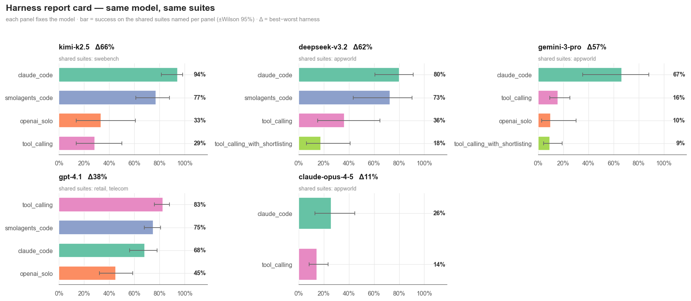

*Each panel fixes the model; each bar is one harness's success on the suites that
model's harnesses share (±Wilson 95% CI). Δ = best−worst harness. **The shared suites
are named under each panel title** — note Claude, Gemini, and DeepSeek share only
`appworld`, so those report cards are an appworld-only read, while gpt-4.1 spans two
τ²-bench suites.*

> **Some takeaways:** For coding tasks, `claude_code` performs better than other
> harnesses. However, with DeepSeek-V3.2 the ceiling behavior of `smolagents_code`
> meets that of `claude_code`.

---

## 4. The test matrix — what ran where (and why confounds matter)

Not all models ran all benchmarks. Claude and Gemini hit all six. DeepSeek and Kimi ran only appworld + swebench. GPT-4.1 ran only tau2.

This is a **confound** — you can't pool averages and claim one model is better. The mix of tasks each model tackled is different. That's Simpson's paradox: aggregated ranking can flip when you stratify by benchmark.

| Model | appworld | browsecompplus | swebench | tau2_airline | tau2_retail | tau2_telecom |
|---|---|---|---|---|---|---|
| claude-opus-4-5 🔒 | 119 | 49 | 138 | 34 | 126 | 43 |
| gemini-3-pro 🔒 | 170 | 77 | 30 | 38 | 34 | 12 |
| Kimi-K2.5 🔓 | 49 | 7 | 75 | — | — | — |
| DeepSeek-V3.2 🔓 | 62 | — | 55 | — | — | — |
| gpt-4.1 🔒 | — | — | — | 124 | 295/14 | 131 |
| gpt-5.2 🔒 | — | — | 37/15 | — | — | — |

🔓 = open weights · 🔒 = closed

**Solution:** We compare only within benchmarks. Claude vs Gemini? Only on the six suites they both ran. When confounds are unobserved (e.g., can't compare open vs closed on tau2), we say so.

<details>
<summary>Full (harness × model) × benchmark test map</summary>

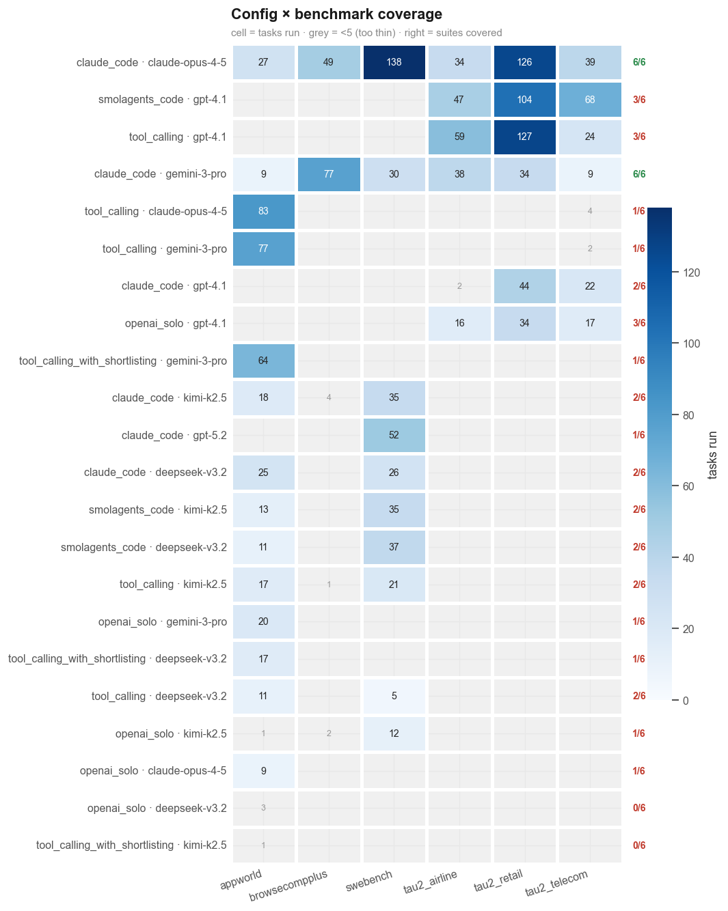

*Cell = sessions run; grey = <5 (too thin to score); right column = suites covered.
This is the map we use to decide which comparisons are direct — e.g. §7 compares
harnesses only within cells they actually share.*

</details>

**Seeing the paradox directly.** Here's why pooling lies. Each bar is a config's
*pooled* (micro) success rate; each red diamond is the *benchmark-balanced* (macro)
rate. Where the diamond sits well to the **left** of its bar, that config's headline
is flattered by an easy task mix — the exact loophole stratifying closes.

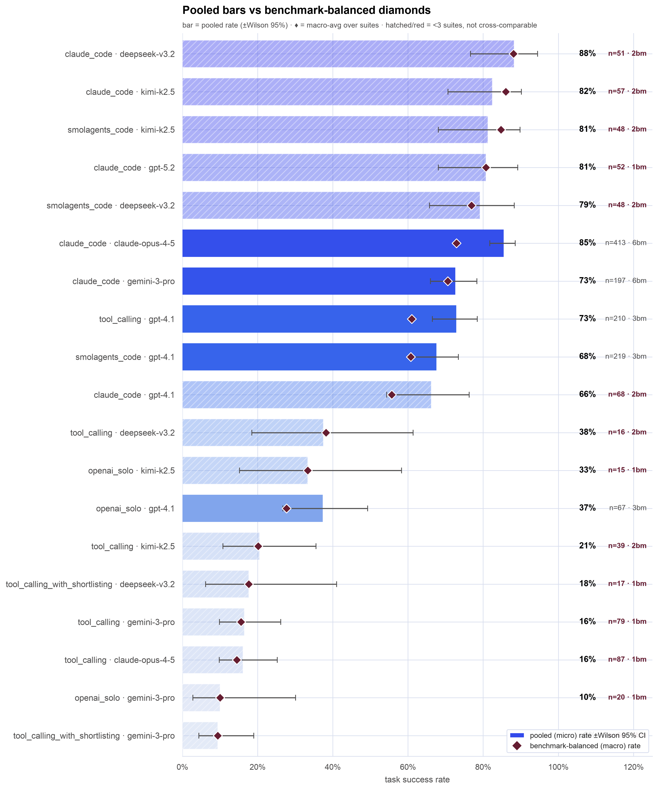

*Bars = pooled rate (±Wilson 95% CI); diamonds = benchmark-balanced rate. Hatched
bars / red suite-counts ran fewer than 3 suites — not cross-comparable. A big bar-to-
diamond gap is the confound made visible.*

> **Some takeaways:** Across the configs that *can* be compared (≥3 suites, with
> benchmark balancing), the `claude_code` harness is performing better — Claude (73%)
> and Gemini (71%) lead the gpt-4.1 harnesses (61% / 61% / 28%).

---

## 5. Per-benchmark efficiency: Claude Opus 4.5 vs Gemini 3 Pro

The only fair full-suite comparison. Done **per benchmark** (holding the benchmark
constant) because a single pooled average would be confounded by each model running
a different mix/number of tasks (Simpson's paradox).

| Benchmark | Metric | Claude Opus 4.5 | Gemini 3 Pro | Winner |
|---|---|---|---|---|
| appworld | avg tokens | 2,485,379 | 595,332 | **Gemini (4.2× fewer)** |
| | avg duration (s) | 232 | 314 | Claude |
| browsecompplus | avg tokens | 2,408,136 | 1,288,647 | **Gemini (1.9× fewer)** |
| | avg duration (s) | 168 | 231 | Claude |
| swebench | avg tokens | 819,283 | 1,874,468 | **Claude (2.3× fewer)** |
| | avg duration (s) | 213 | 469 | Claude |
| tau2_airline | avg tokens | 323,256 | 237,633 | Gemini |
| | avg duration (s) | 74 | 124 | Claude |
| tau2_retail | avg tokens | 354,912 | 270,031 | Gemini |
| | avg duration (s) | 69 | 112 | Claude |
| tau2_telecom | avg tokens | 453,399 | 194,960 | **Gemini (2.3× fewer)** |
| | avg duration (s) | 117 | 144 | Claude |

**Takeaways (efficiency only):**
1. **Gemini is more token-efficient on 5 of 6 benchmarks** — sometimes dramatically
   (4.2× fewer on appworld). The exception is **swebench**.
2. **Claude is faster (lower wall-clock) on every single benchmark**, even when it
   uses more tokens. "Efficiency" splits two ways: Gemini wins on token cost, Claude
   wins on latency.
3. **The swebench reversal** is the standout — the one benchmark where Gemini blows
   up (52 calls, 1.87M tokens) while Claude stays lean.

> But this is EFFICIENCY ONLY — it says nothing about whether the agent actually
> succeeded. That's what sent us deeper.

<!-- TODO: Braintrust enabled this section
What you CAN'T do with raw HF traces:
- Download 39 parquet shards, hand-compute grouped averages per (model, benchmark)
- Spot the confound: Claude and Gemini ran different mixes of tasks
- Fix it with stratified stats (Simpson's paradox)

What Braintrust made easy:
- SQL query: "SELECT benchmark, model, AVG(tokens) ... GROUP BY benchmark, model"
- UI filters + instant pivot tables (no data pipeline)
- Visual: plot 12 benchmark × model cells with error bars in seconds

One query, one plot, one insight ("Gemini beats Claude on 5/6, except swebench").
The raw data didn't tell you which confounds to control for until you saw the coverage matrix.
-->

---

## 6. The problem: no ground truth (so we built a judge)

Here's the problem: HuggingFace never published the benchmark verdicts. SWE-bench has hidden test cases. AppWorld checks database state. Tau2 has secret rubrics. The dataset has zero ground-truth labels — all `scores` and `expected` fields are null.

We built an LLM-as-judge proxy.

**The approach:**
1. For each of 1,781 runs, extract the full final conversation (all tool calls, results, agent's final message)
2. Feed GPT-4.1 the task + conversation + grading rubric specific to that benchmark
3. Get back: success (0/1), confidence (low/medium/high), reasoning (<35 words)
4. Store as `scores.task_success` + `metadata.judge_*` on the root span (queryable, auditable)

**Judge model routing:** GPT-4.1 for all runs, except GPT-4.1's own runs are judged by GPT-4o (avoid self-grading). Only OpenAI models available on Braintrust proxy, so neutrality has limits.

**Coverage & reliability:**
- **Coverage:** 1,780 / 1,781 runs (99.9%)
- **Overall:** ~64% success
- **By benchmark:**
  - **🟢 STRONG (SWE-bench, 91%):** Judge sees actual diff + test output; can verify independently
  - **🟡 MEDIUM (AppWorld 47%, Tau2_* 42–83%):** Judge sees tool calls + agent's confirmation, but not hidden DB state
  - **🔴 WEAK (BrowseComp, 64%):** No gold answer; judge must infer from reasoning quality

**Important:** The judge scores "did the agent produce a complete, self-verified result" — a proxy of success, not ground truth. A run can pass the judge but fail the benchmark's official hidden tests.

<details>
<summary><b>🔬 The exact judge prompt &amp; per-benchmark grading rules</b> (click to expand)</summary>

System message (the `{task type}` and `{grading rule}` are filled per benchmark):

```
You grade whether an AI agent SUCCEEDED at a task, from its execution trace.
Task type: {benchmark description}
Grading rule: {benchmark-specific rubric}
You see the task and the agent's full final conversation incl real tool outputs.
Judge from visible verification; you may NOT have the official grader.
Be strict: ambiguous/unverified = 0.
Respond ONLY with JSON: {"success":0 or 1,"confidence":"low"|"medium"|"high","reasoning":"<=35 words"}
```

User message: `=== TASK ===\n{task}\n\n=== AGENT TRACE ===\n{final conversation}`

Per-benchmark grading rules (abbreviated):
- **swebench:** real diff addressing the issue AND verified (tests/checks pass, no
  unresolved errors) = 1.
- **appworld:** ALL requested actions done with correct params and finished cleanly,
  no unresolved errors blocking the goal = 1.
- **tau2_*:** fulfilled the user's actual request via correct tool actions and
  confirmed completion = 1.
- **browsecompplus:** clear, specific final answer well-supported by gathered
  evidence = 1.

</details>

### Worked example — gut-checking the verdict

The most instructive log we hand-checked: the agent **finished cleanly with ZERO
tool errors**, yet was correctly scored a **failure** — exactly the case a naive
metric would miss.

- **Log:** `86c1014d-321f-522b-ae63-5a0b2da977f9` · benchmark `appworld` · model
  `claude-opus-4-5` · `error = "[0 tool error(s) detected...]"` · **task_success = 0**
- **Task:** *"Reset friends on venmo to be the same as my friends in my phone.
  Befriend and unfriend as needed."*
- **Judge reasoning:** *"The agent only attempted to remove friends from Venmo but
  did not add any missing friends from the phone contacts. The task required both
  befriending and unfriending as needed."*
- **What the agent actually did** (tool calls from the trace): login →
  `search_friends` ×3 → `show_profile` ×2 → `remove_friend` ×~15 → `finish(success)`.
  **Zero `add_friend` calls.**
- **Our conclusion:** judge is **correct**. The task required both add and remove;
  the agent did only removals then declared success with 0 errors — a textbook
  "false success confirmation." An error-rate or finish-status metric would have
  called this a pass. (Honest caveat: the judge *assumed* additions were needed; it
  had the `search_friends` results in context, so it most likely saw the gap — but
  this is the inherent soft edge of a medium-reliability proxy.)

**Topics found this failure class on its own.** The **Issues** facet (§1c) clustered
the misbehaviors into 11 named groups — and `False success confirmation` (10.9%) is
exactly the Venmo pattern above. `Incomplete multi-step execution` (32.2%) and
`Truncated task completion` (13.7%) are the thrash/give-up modes we quantify in §8.
The taxonomy we built by hand fell out of the clustering automatically:

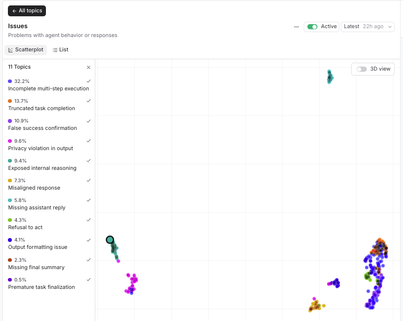

*The Issues facet auto-surfaced the failure taxonomy: false success confirmation,
incomplete multi-step execution, truncated completion, exposed internal reasoning,
and more — a head start on the manual §2/§8 failure-mode analysis.*

---


---

## 7. Indexing on harness too — the ultimate table

Two confounds had to be controlled together: **benchmark** (§5) and **harness** (§3).
A single model+benchmark cell often mixes harnesses (e.g. Claude's 119 appworld
sessions = `tool_calling` 83 + `claude_code` 27 + `openai_solo` 9). So the truly fair
unit is **benchmark × harness × model**. This table combines everything —
efficiency AND judged success — for cells with n ≥ 10.

<!-- TODO: How Braintrust made the confound control work
Raw HF traces:
- You see 1,781 traces, but have to manually scan each one to extract (benchmark, harness, model)
- Build a 3D lookup manually; hand-check for sparse coverage
- Compute cell-level stats with a custom script

Braintrust approach:
- metadata.benchmark, metadata.harness, metadata.model are queryable fields on every span
- One SQL query: "SELECT benchmark, harness, model, COUNT(*), AVG(tokens), scores.task_success ... GROUP BY 1,2,3"
- Filter by n ≥ 10, sort by delta (best - worst)
- Export to CSV, plot in seconds
-->

Columns: n = sessions · calls = avg LLM calls · Mtok = avg tokens (millions) ·
dur = avg duration (sec) · **succ% = LLM-judge success rate**.

```
APPWORLD                                n  calls   Mtok   dur  succ%
claude_code      DeepSeek-V3.2  🔓     25   19.9   2.25   387    80
claude_code      Kimi-K2.5      🔓     18   17.7   1.17   398    78
claude_code      claude-opus-4-5      27   31.7   4.19   316    26
smolagents_code  Kimi-K2.5      🔓     12   12.9   0.53   429    92
openai_solo      gemini-3-pro         20   19.2   1.10   339    10
tool_calling     DeepSeek-V3.2  🔓     11   17.7   1.64   891    36
tool_calling     gemini-3-pro         77   15.6   0.59   263    16
tool_calling     claude-opus-4-5      83   25.7   2.09   221    14
tool_calling     Kimi-K2.5      🔓     17   17.5   0.91   657    12
tcw_short        DeepSeek-V3.2  🔓     17   19.3   0.21   531    18
tcw_short        gemini-3-pro         64   28.8   0.27   370     9

BROWSECOMPPLUS                          n  calls   Mtok   dur  succ%
claude_code      claude-opus-4-5      49   30.1   2.41   168    69
claude_code      gemini-3-pro         77   20.5   1.29   231    55

SWEBENCH                                n  calls   Mtok   dur  succ%
claude_code      claude-opus-4-5     138   27.8   0.82   213   100
claude_code      DeepSeek-V3.2  🔓     26   58.8   2.07  1220    96
claude_code      Kimi-K2.5      🔓     35   46.0   1.08   477    94
claude_code      gpt-5.2              15   29.9   0.74   106    93
claude_code      gemini-3-pro         30   52.2   1.87   469    87
claude_code      Az/gpt-5.2           37   24.1   0.52   144    76
smolagents_code  DeepSeek-V3.2  🔓     24   63.8   1.62  1503    88
smolagents_code  o/Kimi-K2.5    🔓     28   87.9   2.58   700    75
smolagents_code  o/DeepSeek-V3.2 🔓    13   84.7   2.36   647    69
openai_solo      Kimi-K2.5      🔓     12   36.8   0.33   227    33
tool_calling     Kimi-K2.5      🔓     21   43.3   0.55   273    29

TAU2_AIRLINE                            n  calls   Mtok   dur  succ%
claude_code      gemini-3-pro         38   11.1   0.24   124   100
claude_code      claude-opus-4-5      34   12.1   0.32    74    65
tool_calling     gpt-4.1              59    5.8   0.01    24    47
smolagents_code  gpt-4.1              47    6.3   0.01    54    40
openai_solo      gpt-4.1              16    4.8   0.01    31    12

TAU2_RETAIL                             n  calls   Mtok   dur  succ%
claude_code      claude-opus-4-5     126   13.6   0.35    69    95
claude_code      gpt-4.1              30    7.4   0.01   144    93
claude_code      Az/gpt-4.1           14    7.4   0.01   204    93
smolagents_code  gpt-4.1             104    6.3   0.01    97    90
tool_calling     gpt-4.1             127    7.4   0.01    92    90
claude_code      gemini-3-pro         34   12.4   0.27   112    82
openai_solo      gpt-4.1              34    5.9   0.01    76    65

TAU2_TELECOM                            n  calls   Mtok   dur  succ%
claude_code      claude-opus-4-5      39   16.8   0.48   116    82
smolagents_code  gpt-4.1              68   20.3   0.07   170    51
tool_calling     gpt-4.1              24   17.0   0.07   151    46
claude_code      gemini-3-pro         10    9.0   0.21   145    33
claude_code      gpt-4.1              22   24.7   0.09   224    18
openai_solo      gpt-4.1              17    3.1   0.01    18     6
```

`tcw_short` = tool_calling_with_shortlisting.

Same data as head-to-head harness comparisons — each panel fixes a model **and** a
benchmark, then ranks the harnesses that ran it, ordered by Δ (the best−worst gap):

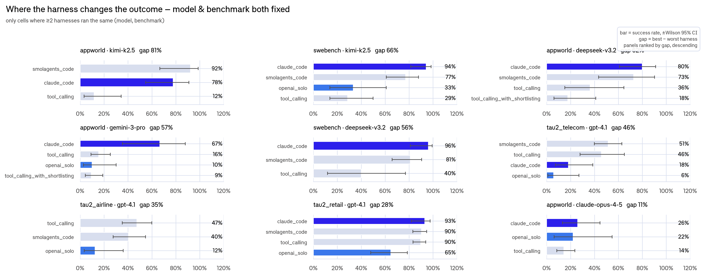

*Each panel fixes the model AND the benchmark; bars are the harnesses run head-to-head
on it (±Wilson 95%), ranked by Δ = best−worst harness. The harness moves success by up
to 81 points on the same model + suite (appworld / Kimi-K2.5: 92% smolagents → 12%
tool_calling).*

> **Some takeaways:** The harness winner flips by task. `smolagents_code` tops
> appworld/Kimi and `claude_code` tops both swebench panels — but on conversational
> suites it's mixed: `claude_code` is near the bottom on tau2_telecom (gpt-4.1, 18% —
> only `openai_solo` lower), even though it *tops* tau2_retail (93%).

---

## 7b. Reliability — the dependable workhorses vs the gamblers

A high average isn't the same as being dependable. Plotting each config's
**benchmark-balanced success** (x) against its **cross-task spread** (y) splits the
field cleanly: bottom-right configs score high *and* behave the same on every suite
(the workhorses); top-right configs are *gamblers* — great on average, but with a
suite where they fall apart. Because x is the macro rate and y is the spread of the
same per-suite cells, a config can't buy its way rightward by running easy tasks.

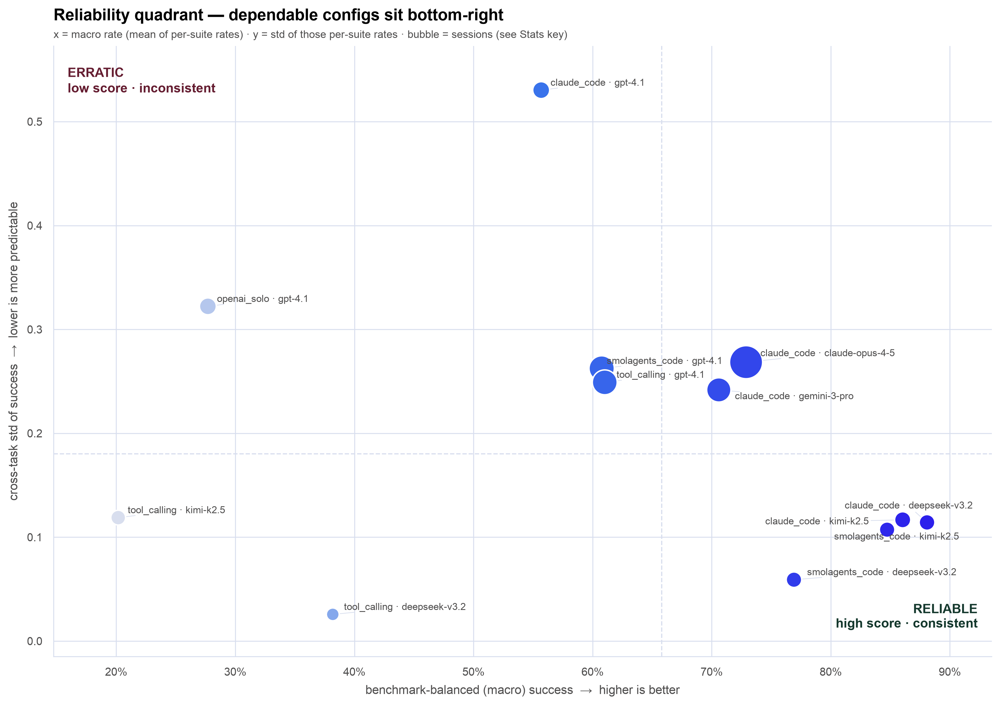

*Bottom-right = dependable (high + consistent); top = erratic. The open-weight
`claude_code` configs (DeepSeek, Kimi) sit in the reliable corner alongside Claude
Opus; the gpt-4.1 configs scatter high on the spread axis.*

> **Some takeaways:** *Caveat — the balancing is imperfect:* the open-weight configs
> here are scored over only two coding/agentic suites (appworld + swebench), not all
> six, so their macro isn't strictly comparable to the full-coverage configs. With
> that said, `smolagents_code` with DeepSeek-V3.2 and Kimi-K2.5 — which were mostly
> tested on coding tasks — are both highly reliable *and* highly successful (high
> macro, low cross-task spread). Among the full-six-suite configs, `claude_code ·
> claude-opus-4-5` (73%) does perform better than `claude_code · gemini-3-pro` (71%),
> but with a slightly more erratic nature (std 0.27 vs 0.24).

The quadrant compresses each config to one spread number — this heatmap is the
receipt. Scan a row: an all-green row is a genuine generalist; a single red cell in
an otherwise green row is the suite where that config will burn you in production.

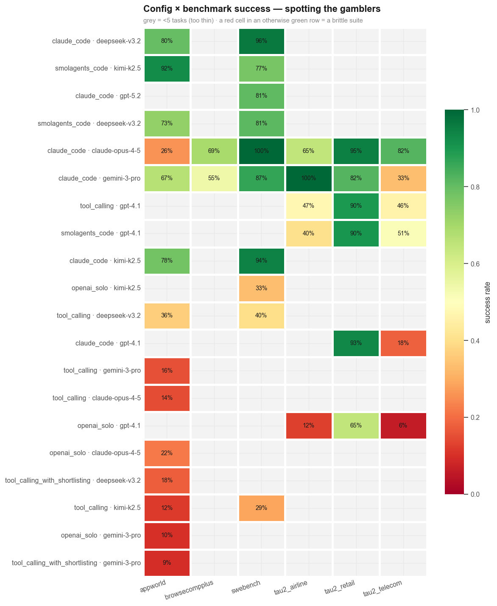

*Grey = <5 tasks (too thin). `claude_code · claude-opus-4-5` is the textbook gambler —
100% on swebench but 26% on appworld. The top open-weight rows are tight and green.*

> **Some takeaways:** This is the per-suite receipt behind the quadrant. The two full
> rows expose the gamblers: `claude_code · claude-opus-4-5` is the textbook case —
> 100% on swebench but 26% on appworld — and `claude_code · gemini-3-pro` drops to 33%
> on telecom. The open-weight rows are short (only appworld + swebench) but tight and
> green.

---

## 8. What we learned

**1. Open models are frontier-class for coding.**
On SWE-bench with `claude_code` harness: DeepSeek 96%, Kimi 94%, Claude 100%, Gemini 87%. Open models tie or beat closed models at the top. You can self-host them. That's the strongest, most defensible result in the dataset.

**2. The harness matters as much as (or more than) the model.**
Same model, different harness:
- Claude on swebench: 100% (`claude_code`) vs 14% (`tool_calling`)
- Kimi on appworld: 92% (`smolagents_code`) vs 12% (`tool_calling`)
- GPT-4.1 on telecom: 51% (`smolagents_code`) vs 18% (`claude_code`)

We fit a linear regression: `success ~ C(benchmark) + C(model) + C(harness)` on all 1,780 rows with HC1 standard errors. Controlling for both model and benchmark:
- **Harness explains ~5.3% incremental variance**
- **Model explains ~0.7% incremental variance**
- **~7× difference**, and `claude_code` is +28 points above baseline

Cost barely changes. This is the highest-leverage, cheapest dial you control.

**3. No universal winner — different models own different jobs.**
- **SWE-bench:** Claude, DeepSeek, Kimi (coding)
- **AppWorld:** DeepSeek, Kimi (workflow orchestration)
- **Tau2_airline:** Gemini 100% (rule-bound support)
- **Tau2_retail:** Claude 95% (transaction support)
- **Browse:** Claude 69% (research/synthesis)

Pick the model for the task. There's no "best model," only "best for this job."

**4. Efficiency without success is just failure with fewer tokens.**
GPT-4.1 looked 10–100× cheaper. But hand-checking failures shows: it wasn't smarter, it was giving up. On hard tasks (swebench, appworld), GPT-4.1 failed 53–90% of the time *and* used fewer tokens. Cost per successful outcome flips the rankings completely: Claude hits 96% on swebench at 0.82M tokens, DeepSeek hits 96% at 2.07M tokens (but takes 20 minutes). Kimi + smolagents on appworld: 92% success at 0.53M tokens — the best cost/outcome anywhere.

**5. Failure patterns are opposite, so token guards need context.**
- **Coding failures:** burn *more* tokens (thrashing). Failures on browse use 2.3× the tokens of successes.
- **Service failures:** burn *fewer* tokens (giving up). GPT-4.1 on hard tau2 tasks fails fast.

A single "cap tokens at 2M" rule helps coding but breaks customer service agents. Token budget needs to match the task type.

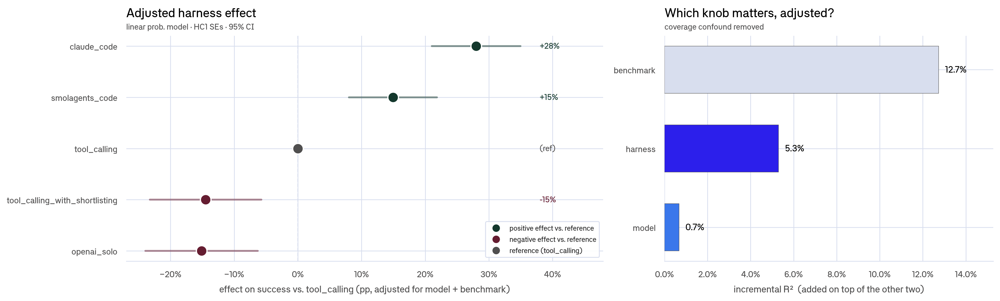

*Left: each harness's effect on success vs. `tool_calling`, with model and benchmark
held fixed. Right: how much of the variation in success each knob explains — harness
far outweighs model.*

> **Some takeaways:** The biggest determinant of agent success is the benchmark
> itself — in plain terms, the kind of task you ask the agent to do. Coding, browsing,
> multi-app workflows, and customer-support tasks have very different difficulty
> profiles.
>
> But after controlling for benchmark, the harness matters much more than the model.
> A harness is the agent scaffold around the model: it decides how tools are
> presented, how model outputs are parsed, how actions are executed, how errors are
> handled, and when the agent stops.
>
> The harness effects are directionally clear. `claude_code` and `smolagents_code`
> both improve performance, likely because they give the model richer agent loops:
> `claude_code` uses Claude's native agent-style interaction pattern, while
> `smolagents_code` lets the model write and execute code to call tools. In contrast,
> `tool_calling_with_shortlisting` appears to undercut performance, suggesting that
> narrowing the available tool set can remove useful options or add routing mistakes.
> `openai_solo`, the minimal scaffold, is also weak, which reinforces the point that
> the model alone is not the agent.

<!-- TODO: The regression wouldn't exist without Braintrust
With raw HF traces:
- You'd compute one-way breakdowns: avg success by harness, avg success by model
- You'd notice the gap ("harness looks bigger"), but can't prove it
- Confounds are hard to see: you'd need to manually slice 3D data

With Braintrust:
- Every row has metadata (benchmark, harness, model) + outcome (scores.task_success)
- Feed 1,780 rows into statsmodels.formula.api: statsmodels.fit("success ~ C(benchmark) + C(model) + C(harness)", ...)
- One line of Python gives you coverage-adjusted coefficients, standard errors, R²
- Plot the incremental R² for each factor

This isn't a coincidence: the regression is impossible without queryable metadata on every span.
Raw traces don't have that structure built-in; Braintrust does.
-->

<details>
<summary>🔬 The model behind those numbers (regression detail)</summary>

We fit a **linear-probability model** `success ~ C(benchmark) + C(model) + C(harness)`
with heteroskedasticity-robust (HC1) standard errors. Because benchmark and model are
in the model, each harness coefficient is its effect *holding the suite mix and model
fixed* — the coverage-adjusted number the raw averages can't give. `tool_calling` is
the reference, so every coefficient reads as "points above `tool_calling`, all else
equal"; `claude_code` lands at **+0.28 (95% CI clears 0)**.

**Adjusted ≠ balanced.** This is *not* the benchmark-**balanced (macro)** rate used
in the reliability plots above. There, each config's per-suite rates are averaged
with **equal weight per suite**. Here, benchmark is a **covariate** that *partials
out* its main effect, but every rollout still counts **once** — suites with more
tasks pull the fit harder, and we do not re-weight them to equal size. Both kill the
same coverage confound by different means: the macro rate **re-weights**, the
regression **adjusts**.

"~7× more" is **incremental R²** — the extra variance each factor explains when added
*on top of the other two*: harness **5.3%**, model **0.7%**, benchmark **12.7%**. This
is the coverage-adjusted version of a one-way comparison (which had inflated the gap
to 18% vs 4%). A logistic fit gives the same ordering and significance; we use the
linear model only for interpretable percentage-point effects.

</details>

**3. The "open crushes closed on AppWorld" headline was mostly a harness artifact.**
Raw appworld looked like open ≫ closed, but closed models ran appworld mostly under
the worst harness (tool_calling). Same-harness, a narrower truth survives: open
weights still beat **Claude** specifically (Claude is weak on appworld — 26% even in
its own harness), but Gemini does fine (67%).

**4. GPT-4.1's "amazing efficiency" was failure in disguise.** It's 10–100× cheaper
on tokens, but cheap only pays off on tau2_retail (90–93%). On airline (40–47%) and
telecom (best 51%) it's mediocre — cheap because it does less, not because it's
better. Cost without success is meaningless.

**5. Cost-per-success flips rankings.** On swebench, Claude and DeepSeek both hit
~100/96% — but Claude does it at 0.82M tokens / 213s while DeepSeek burns 2.07M /
1220s (20 min) for the same outcome. gpt-5.2 is the sleeper: 93% at the lowest cost
and fastest. The best cost/outcome cell anywhere is Kimi+smolagents on appworld (92%
at 0.53M tokens); the worst is Claude+claude_code on appworld (4.19M tokens to fail
74%).

**6. Failure looks OPPOSITE on the two task families.**
- On hard agentic/coding tasks (swebench, appworld, browse) → failure = **THRASHING**:
  failed runs make *more* calls, burn *more* tokens, run *longer*, and still fail
  (browse failures use 2.3× the tokens of successes).
- On conversational tau2 tasks → failure = **GIVING UP**: failed runs make *fewer*
  calls, burn *fewer* tokens, finish *faster*.
- **Ops implication:** an "abnormal token usage" guardrail needs opposite thresholds
  per task type — cap the thrashers on coding, but a suspiciously cheap/short run is
  the danger sign on conversational tasks. A single "cap tokens" rule would help one
  and hurt the other.

The clearest picture of the thrashing pattern is **token usage among failed runs**.
Pooled, `claude_code` failures have a giant spread — its median failed run burns
~0.8M tokens and the box stretches past 3.7M, while `smolagents_code` failures stay
tiny:

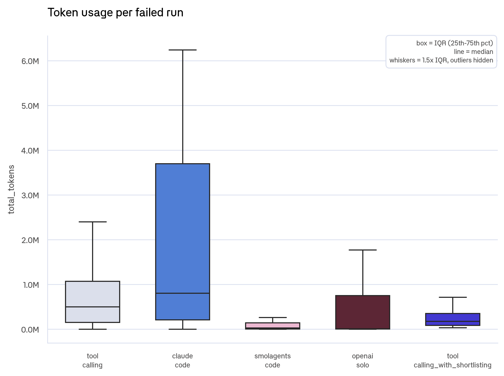

*Left: tool-call errors per failed run are near-zero everywhere (the `error` field is
not a failure signal). Right: token usage per failed run — `claude_code` failures
have a huge upper tail (thrashing), others stay lean.*

> **Some takeaways:** Failed runs thrash — there's some of it with `tool_calling`, but
> a **lot** more with `claude_code` (median ~0.8M tokens, tail past 3.7M). (Caveat:
> this is pooled across suites, so part of `claude_code`'s tail is just that it ran
> the token-heavy coding/browse suites — the per-benchmark view below isolates it.)

But token usage is **dominated by the benchmark** (a swebench run dwarfs a tau2 one),
so the pooled view partly ranks harnesses by which suites they ran. Holding the
benchmark fixed isolates each harness's own burn profile — and the thrash/give-up
split survives: on appworld and swebench, failing runs blow through millions of
tokens; on tau2 they barely spend any (note the k-scale axes).

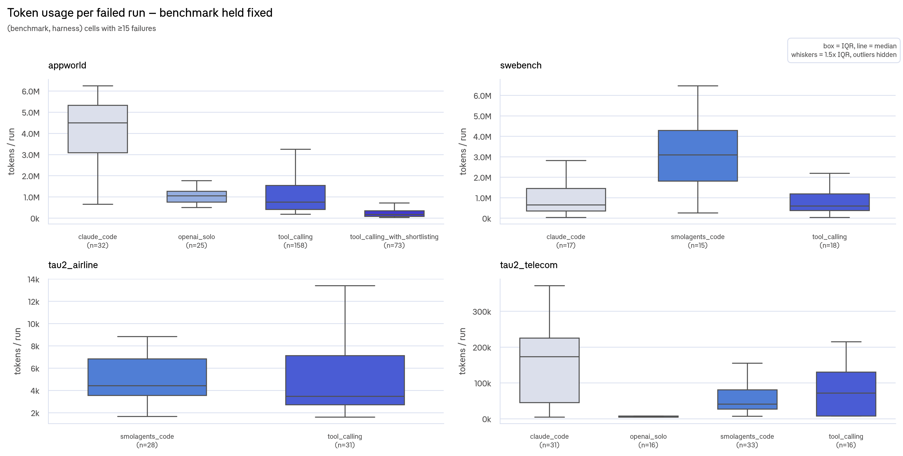

*Each panel fixes the benchmark (cells with ≥15 failures). Coding suites (top, M-scale)
vs conversational suites (bottom, k-scale) — failure means thrashing in one and giving
up in the other.*

> **Some takeaways:** Holding the suite fixed (mind the wildly different y-scales —
> appworld/swebench are M-scale, tau2_airline ~k-scale, telecom ~100k) confirms two
> things: the thrash-vs-give-up split is real (coding suites burn millions per failed
> run, tau2 failures burn almost nothing), and the harness that thrashes most flips by
> suite — `claude_code` on appworld (~4.5M median), but `smolagents_code` on swebench
> (~3.1M, above claude_code's ~0.9M).

The *kind* of failure differs too. Bucketing each failed run into a dominant mode
(within a fixed benchmark) shows tau2 failures are almost entirely **silent wrong
answers** — the agent confidently finishes the wrong thing — while coding failures
skew toward **non-convergence / loops** and runtime errors:

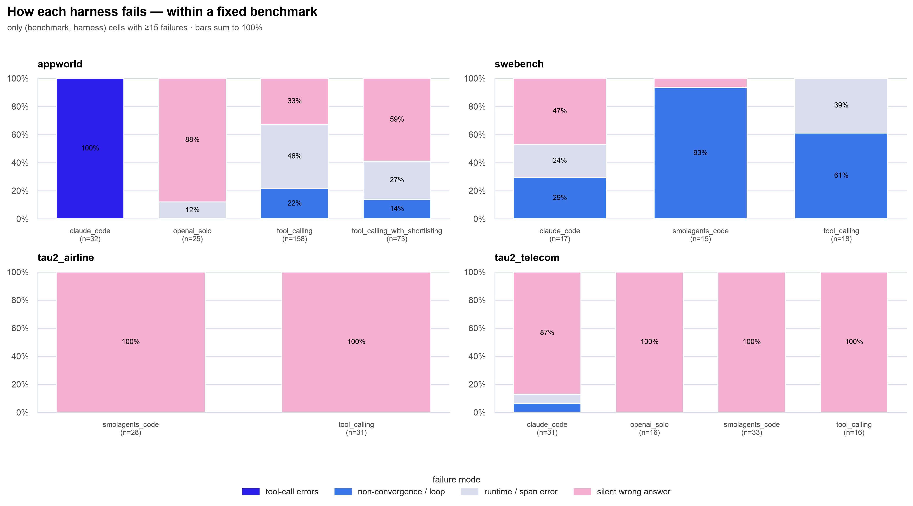

*Bars sum to 100% within each (benchmark, harness) cell. Pink "silent wrong answer"
dominates tau2; orange "non-convergence / loop" shows up on the coding suites — the
same thrash-vs-give-up split, now by failure mode.*

**7. No universal winner — different models own different jobs.** Coding →
Claude/DeepSeek/Kimi; multi-app orchestration (appworld) → open weights; tau2_airline
→ Gemini (100%); tau2_retail/telecom + browse → Claude. "Pick the model (and harness)
for the job" is the honest framing.

**8. Tool errors ≠ task failure; clean finish ≠ success.** The `error` field counts
tool errors even when zero, and tool errors are often just exploration. A run can
finish cleanly with 0 errors and still fail (the venmo example). This is why a real
success measure was necessary.

---

## 9. Cost — what performance actually costs

These are the **same traces** the [Open Agent Leaderboard](https://huggingface.co/blog/ibm-research/open-agent-leaderboard)
(the Exgentic project) scores, so this section extends *their* cost view on *their* data.
The leaderboard makes cost a first-class axis — for every config it reports "the average
success rate, the average cost **per task**, and per-benchmark breakdowns," plots "every
configuration by quality and cost," and headlines two claims: **"failed runs cost 20–54%
more than successful ones"** and that open-weight models **"only tie on cost."**

See https://www.exgentic.ai/


Our export carries exact `total_tokens` (the cost driver) but not a per-run input/output
split, so we price each run with the **same source the paper uses — [LiteLLM's rates](https://github.com/BerriAI/litellm/blob/main/model_prices_and_context_window.json)**
(*"costs are reported using LiteLLM's pricing data"*: Opus `$5/$25`, GPT-4.1 `$2/$8`,
Gemini-3-Pro `$2/$12`, GPT-5.2 `$1.75/$14`, Kimi-K2.5 `$0.60/$3`, DeepSeek-V3.2 `$0.58/$1.68`
per 1M in/out), blended by each model's **measured output share** (agents are input-bound —
output is only ~1–11% of billed tokens). **So the $ here aren't a guess** — real per-token
rates on exact token counts, accurate to a few percent. (Edit the `RATE`/`OUT_SHARE` tables
for your own contract to get more org specific information.)

**Two cost metrics — read this first.** The plots below use two different numbers, and the
gap between them is the point:

| Metric | Definition | Answers |
|---|---|---|
| **Cost per task** | total \$ ÷ **all** runs (wins *and* losses) = mean \$/run | "What does one attempt cost on average?" |
| **Cost per success** | total \$ ÷ **successful** runs = (cost per task) ÷ (success rate) | "What do I pay to get one task actually *done*, including paying for the failed attempts?" |

So `cost per success = cost per task ÷ success rate`. A config that succeeds 1-in-6 pays for
~6 attempts per win (≈6× its per-task cost); a 90%-success config barely differs. **Neither is
per-benchmark** — both pool over *every task a config ran* (one number per config), which mixes
suites across configs. The pooled cost-per-success below is the quick view; the
**per-benchmark** version (last plot) is the apples-to-apples one.

**The deployable frontier (their plot, with the Pareto set drawn).** Every config placed by
quality (benchmark-balanced macro success) against cost (avg $/task, log scale).
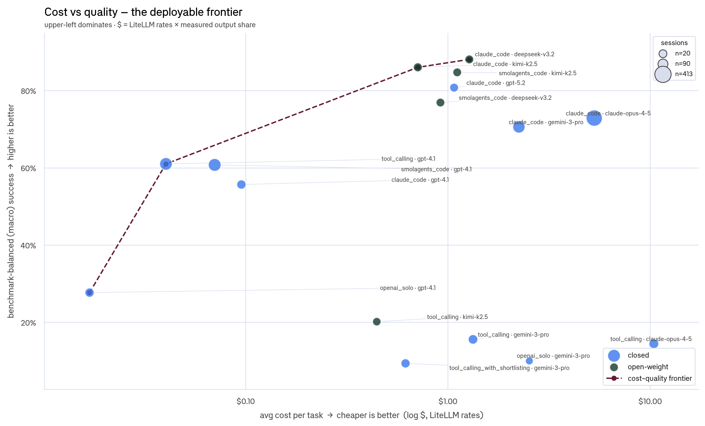

*Upper-left dominates. The open-weight `claude_code` configs (DeepSeek 88%, Kimi 86%) sit on
the frontier and push the closed `claude_code · opus`/`gemini` points off it — at these rates
open doesn't just "tie on cost," it dominates the frontier. Caveat: token cost is
benchmark-driven, so configs that ran the token-heavy coding suites sit further right partly
because of *what they ran*.*

**Cost per *successful* task — where "cheap" stops being cheap.** Average cost per task
flatters configs that fail a lot (a run that bails early is cheap, but you paid for nothing).
The honest denominator is successes: `total spend ÷ solved tasks`.

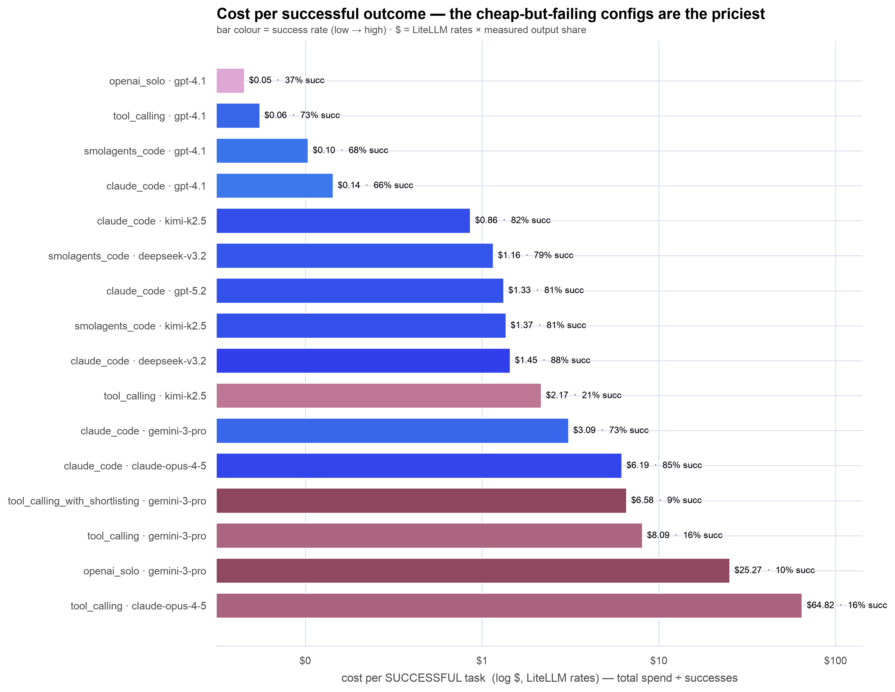

*`tool_calling · claude-opus-4-5` costs **$64.82 per success** (16% success) and
`openai_solo · gemini-3-pro` **$25.27** — versus the open-weight `claude_code` configs at
**$0.86 (Kimi) – $1.45 (DeepSeek) per success** (82–88% success), which *beat* closed
`claude_code · claude-opus` ($6.19) and `· gemini-3-pro` ($3.09). Cheap-per-task ≠
cheap-per-outcome; this is "efficiency without success is just failure with fewer tokens"
as a single number.*

**Do failures really cost more? Only on coding.** The leaderboard's "+20–54%" is true pooled
(ours is +77%) — but holding the benchmark fixed, the rule **reverses**.

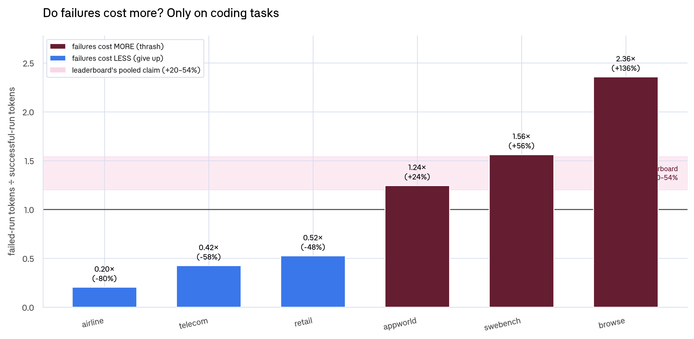

*Coding/agentic failures cost **more** (swebench +56%, browse +136% — the thrash pattern),
but conversational `tau2` failures cost **less** (airline −80%, telecom −58% — the give-up
pattern). The yellow band is the leaderboard's pooled +20–54%. **Ops implication:** a
"cap abnormally expensive runs" guardrail catches coding thrash but misses conversational
give-up, where the *cheap, short* run is the failure — budget alarms need per-task-family
thresholds.*

**Cost per success, within each benchmark (apples-to-apples).** The cost-per-success plot
above pools over whatever suites each config ran, so it inherits the benchmark mix. Holding
the suite fixed is the honest test of "is open *really* cheaper per solved task." We split it
by task family, since coding/agentic and conversational suites live on very different cost
scales — and the answer flips between them.

*Coding / agentic suites — open wins.* The open-cheaper result **survives** holding the suite
fixed, so it isn't a coverage artifact.

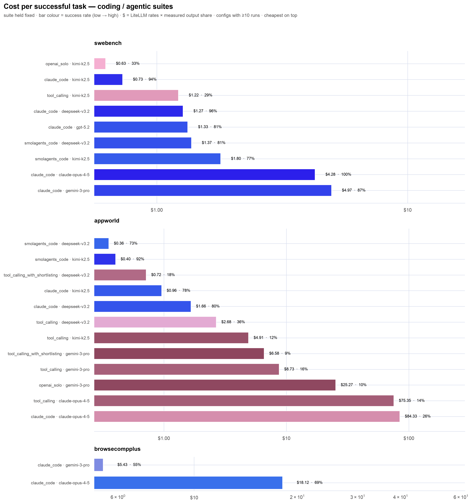

*On **swebench**, `claude_code · kimi-k2.5` costs **$0.73/success** (94%) and `· deepseek-v3.2`
**$1.27** (96%) vs closed `· claude-opus` **$4.28** (100%) and `· gemini-3-pro` **$4.97** (87%).
On **appworld** the gap is 1–2 orders of magnitude: `smolagents_code · kimi-k2.5`
**$0.40/success** (92%) vs `claude_code · claude-opus` **$84.33** (26%) and
`tool_calling · claude-opus` **$75.35** (14%) — closed loses twice, pricier per token *and*
failing more.*

*Conversational τ² suites — cheap closed wins.* Here open-weight models never ran (only
`gpt-4.1`, Claude, and Gemini did), and the story inverts:

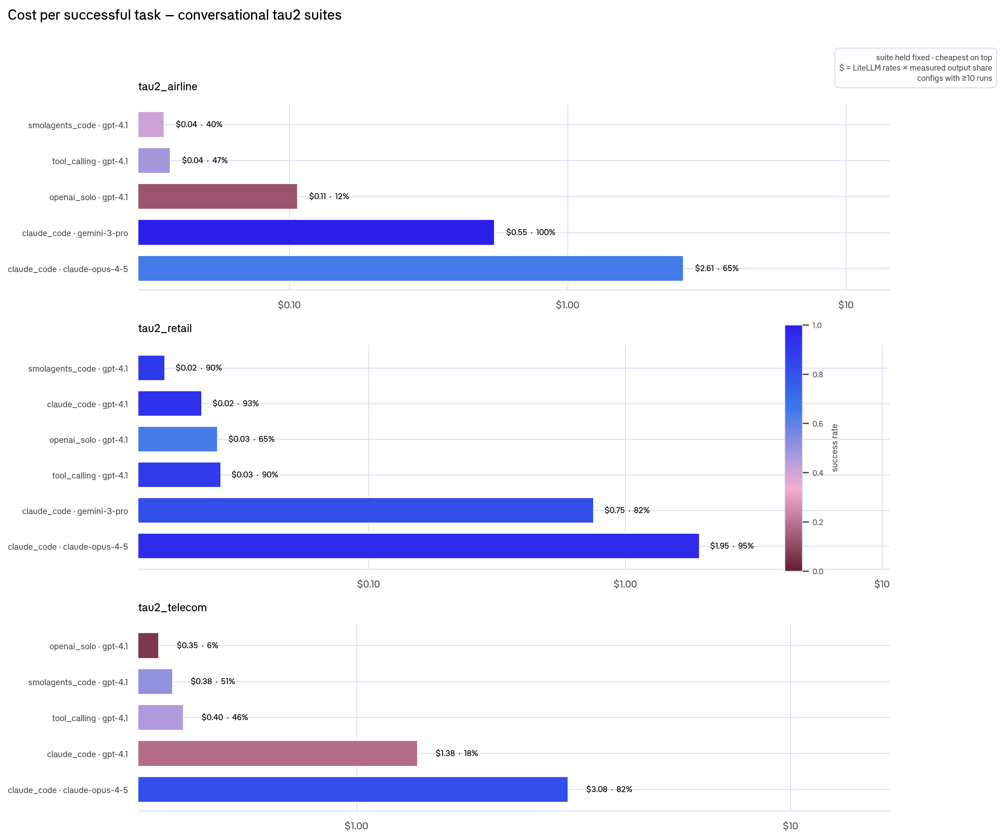

*The cheap `gpt-4.1` configs dominate cost-per-success — on **tau2_retail**, `claude_code` /
`tool_calling` / `smolagents_code · gpt-4.1` all hit **$0.02–0.03/success at 90%+**, versus
`claude_code · claude-opus` **$1.95** (95%) and `· gemini-3-pro` **$0.75** (82%). So
"pick the cheapest model that clears the bar" lands on a *different* model per task family:
open-weight for coding, `gpt-4.1` for conversational support.*

> **Cost bottom line:** choose configs on **cost per success**, not cost per task; at LiteLLM
> rates open-weight models burn more tokens but cost ~8–9× less per token, so they **beat**
> closed on cost-per-success here — "only ties on cost" understates it (though this stays
> rate-dependent — re-run with your contract rates); and "failures cost more" is a
> coding-suite rule, not a universal one.

---

## Caveats to publish with any of this

- `task_success` is an **LLM-judge proxy** of the agent's own verification, not the
  official hidden grader. swebench/appworld solid-ish, browsecompplus weak, tau2 medium.
- `claude_code` dominates the data, so most clean comparisons funnel through it.
- Within a benchmark × harness cell, models ran **different specific task instances**
  (not matched task-for-task), so small gaps are noise.
- n ≥ 10 filter applied, but several cells are only 10–15 (directional).
- swebench Claude 100% is suspiciously perfect — likely some judge leniency reading
  Claude's thorough self-verification. Flag it.
- **Benchmark bleed (contamination).** swebench's gold patches sit on public GitHub,
  so high scores there may partly measure *memorisation*, not capability. Both models
  that ran swebench + a clean suite score far higher on the high-bleed suite than on
  clean BrowseComp+ — a gap consistent with leakage (though task difficulty differs
  too, so it's suggestive, not proof):

  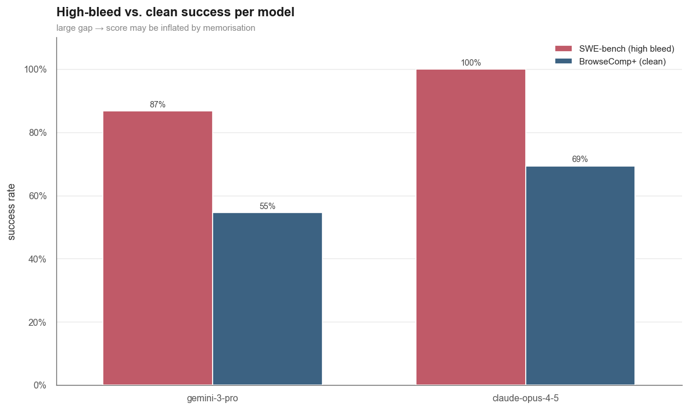

  *Large high-bleed-minus-clean gap → the score may be inflated by training-data
  leakage. Treat swebench numbers as an upper bound on real capability.*

<details>
<summary><b>🔧 Operational note — writing scores back safely (learned the hard way)</b></summary>

When adding `scores.task_success` to existing imported rows, do **NOT** use the SDK
`logger.log(id=..., scores=...)` — it REPLACES the row with only the fields passed,
wiping input/output/metadata. (This silently corrupted 185 rows mid-project before
we caught it; we fully recovered by re-pushing the originals from the source file,
since the ids are deterministic — `uuid5(NAMESPACE_DNS, "root:"+session_id)`.)

**Correct method:** build COMPLETE rows (the original row + the new score) and upload
with `bt sync push project_logs:"..." --in <dir>/`. Because every pushed row is
complete, nothing gets wiped. `bt sync` caches per-spec, so re-pushing a changed file
needs the `--fresh` flag. This is what `scripts/score_and_push.py` does.

</details>

## Where things live
- Scores in Braintrust: `scores.task_success` (0/1) + `metadata.judge_*` on root
  spans. Filter `scores.task_success IS NOT NULL`.
- **Importer (`hf_bt_cookbook/`):**
  - `import_logs.py` — HuggingFace → Braintrust Logs importer used here (defines the
    deterministic id scheme; see §1b). `import_dataset.py` is the sibling for building a
    gradable Dataset.
- **Scripts (`scripts/` in this folder):**
  - `score_and_push.py` — safe LLM-as-judge scorer (judges each session, writes
    COMPLETE rows + scores, uploads via `bt sync push`).
  - `explore_trace.py` — helper to dump a single trace's spans for inspection.
- Source of truth (full export): `hf-traces-jsonl/part-000001.jsonl` (39,833 rows),
  in the working dir `Coding Projects/Work (Braintrust)/`.
